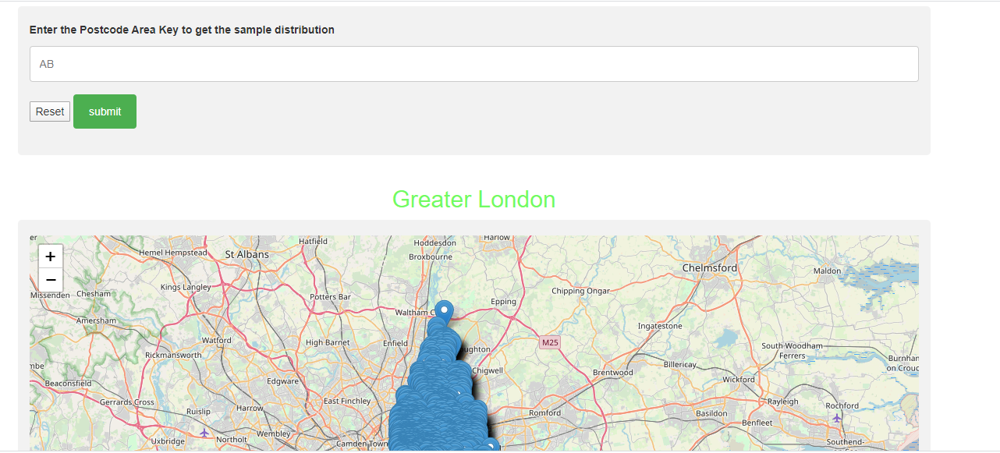

# leaflet_python
This application shows the region wise postcode mapping on for the United Kingdom.
The application uses the folium package and [postcode api](https://postcodes.io/). Folium packageis used to do the mapping with leaflet.js. Folium in the backend uses the leaflet.js for the mapping.

The host [Application Link](127.0.0.1:5002) takes the postcode area key for the UK and then it shows the sample postcode taken for that region. If it does not find the postcode in its own databse then it shows the appropriate response.

